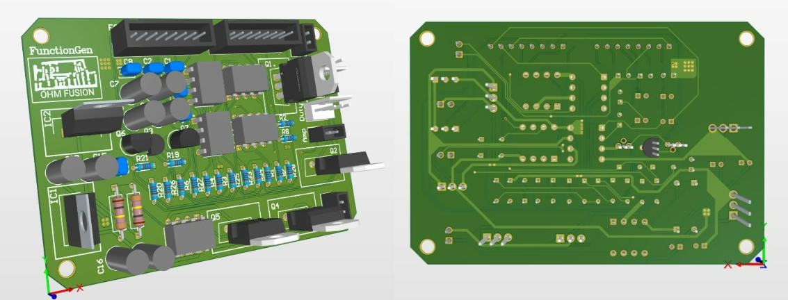

# 📡 Analog Function Generator

*Caption: Analog Function Generator.*

## 🚀 Project Overview
The **Analog Function Generator** is a versatile, open-source tool designed for electronics enthusiasts. It generates multiple waveforms—sine, square, PWM, triangle, and sawtooth—with an adjustable amplitude of 0-12V and a frequency range of 20Hz to 20,000Hz. The device is compact, portable, and ideal for testing and development in analog electronics.

---

## ✨ Features
- **Waveforms**: Sine, Square, PWM, Triangle, Sawtooth
- **Amplitude**: Adjustable 0-12V output
- **Frequency Range**: 20Hz to 20,000Hz
- **Design**: Compact, portable, and built with analog components
- **Open-Source**: Fully documented with schematics and design files

---

## 📐 Circuit Diagram

*Caption: The circuit diagram for the Analog Function Generator.*

---

## 🛠️ Components
- **Resistors**: Various values
- **Capacitors**: Various values
- **Op-Amps**: TL082
- **Potentiometers**: For adjusting amplitude and frequency
- **Power Supply**: 30V DC

---

## ⚙️ How It Works
The **Analog Function Generator** is based on an analog oscillator that creates the base waveform. This waveform is processed through filters and amplifiers, and shaped into different waveforms—sine, square, PWM, triangle, and sawtooth. The output's amplitude and frequency are controlled by potentiometers, providing fine-tuned waveform customization.

---

## 📷 Project Photos

### PCB Photo

*Caption: PCB of the Analog Function Generator.*

### Team Photo

*Caption: The Team.*

---

## 🚀 Setup & Usage

1. **Build the Circuit**: Construct the function generator using the provided circuit diagram on a breadboard or PCB.
2. **Power the Circuit**: Connect the 30V DC power supply.
3. **Select Waveform**: Use the selector switch to choose between the five different waveforms.
4. **Adjust Amplitude & Frequency**: Tune the potentiometers to set your desired output amplitude and frequency.
5. **Connect to Oscilloscope**: Verify the waveforms using an oscilloscope.

---

## 📊 Output Results

*Caption: Output sine waveform generated by the Analog Function Generator.*

*Caption: Output Square waveform generated by the Analog Function Generator.*

*Caption: Output PWM waveform generated by the Analog Function Generator.*

*Caption: Output Triangle waveform generated by the Analog Function Generator.*

## 🧩 Challenges Faced
- **Stability**: Maintaining frequency stability across the entire range.
- **Component Selection**: Choosing the right components to meet performance standards within the compact design.
- **Heat Management**: Addressing heat dissipation in a small form factor.

---

## 🔄 Future Improvements
- **Extended Frequency Range**: Expand the frequency range to cover higher frequencies.
- **Digital Control**: Integrate a digital interface for more precise waveform control.
- **Enhanced Portability**: Further miniaturize the design for improved portability.

---

## 📜 License
This project is open-source under the [MIT License](LICENSE). Feel free to contribute and modify the design to suit your needs.
